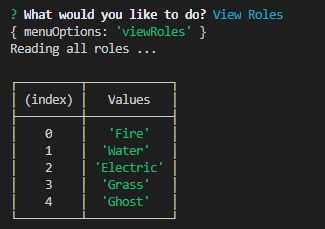

# Employee Roster
Node, [Express](https://expressjs.com/), [Inquirer](https://github.com/SBoudrias/Inquirer.js/) ,and mySQL made friends to make a happy employee roster you can read and update in the terminal.

## Installation 
* Fork the repo and clone on your machine.
* Use `npm install` command in the terminal to acquire express, inquirer and mysql.
* Disclaimer: In the code provided, Departments are represented as Pokemon trainers, Roles as their type, and Employees as the Pokemon themselves.

## Example

## Links

[Demo Video](https://drive.google.com/file/d/1grybF3Pjum-00wl_jNkR2ei5ca5Vy0Tk/view)

[Repository](https://github.com/B-Audette/employee_roster)

